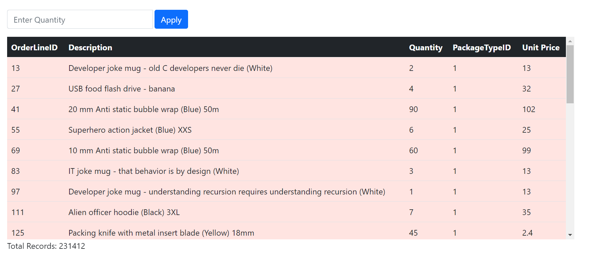
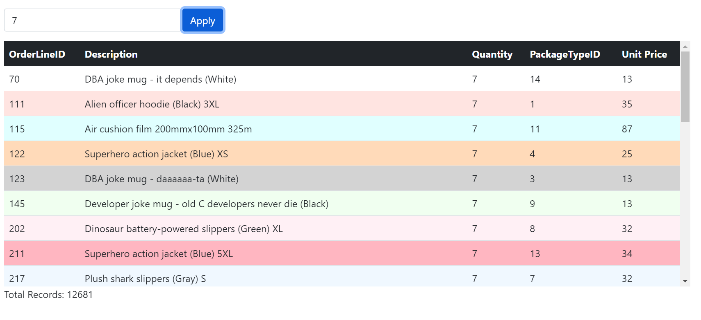
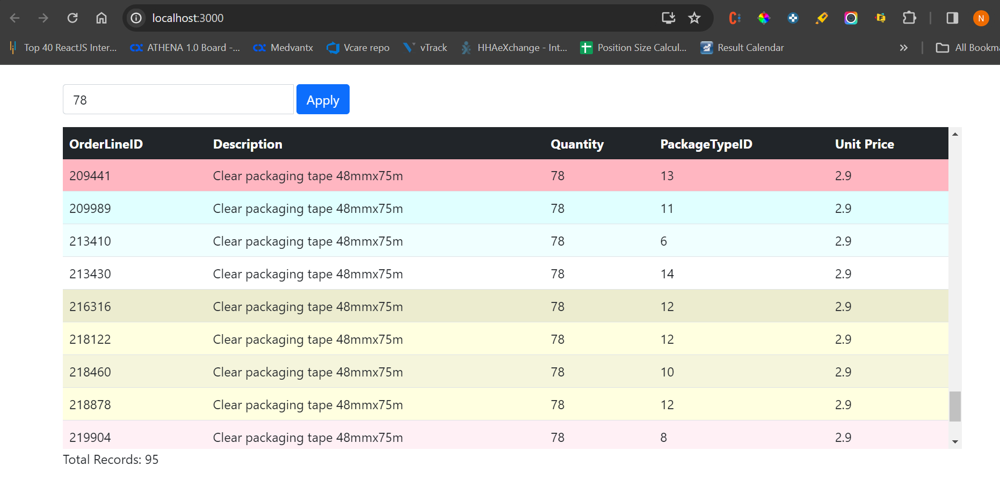

# Minizuba Order Lines UI

## Overview

This project is a user interface (UI) for viewing order lines in the Minizuba packaging solution system. The UI retrieves order line data from the Minizuba API and displays it in a user-friendly format. Users can apply filters to view order lines based on quantity and see the total number of records.

## Features

- Display order lines in a table format
- Filter order lines by quantity
- View total number of records
- Smooth scrolling and lazy loading for performance
- Responsive design for optimal viewing on different devices
- Integration with Bootstrap for clean and consistent styling

## Screenshots







## Installation

To run the project locally, follow these steps:

Steps to run project:

   ```bash
   git clone https://github.com/dayalubana/minizuba.git
   cd minizuba
   npm install
   npm start
    ```
